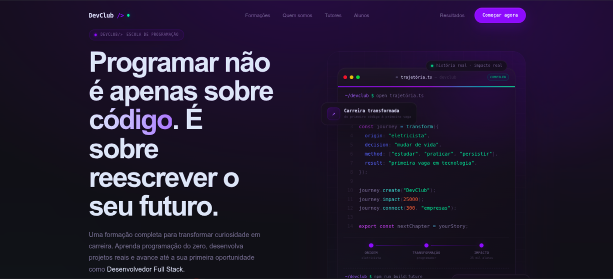

# 🚀 DevClub Landing

  <strong>Uma landing page moderna inspirada em produtos SaaS.</strong> 
  Desenvolvida para o desafio técnico Full Stack do DevClub com foco em UX, animações e código escalável.

  

  

---

# 📸 Preview

